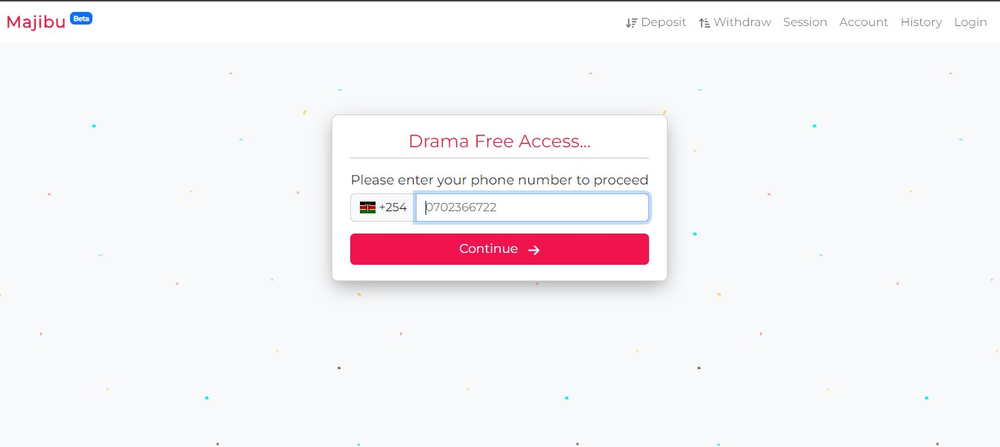
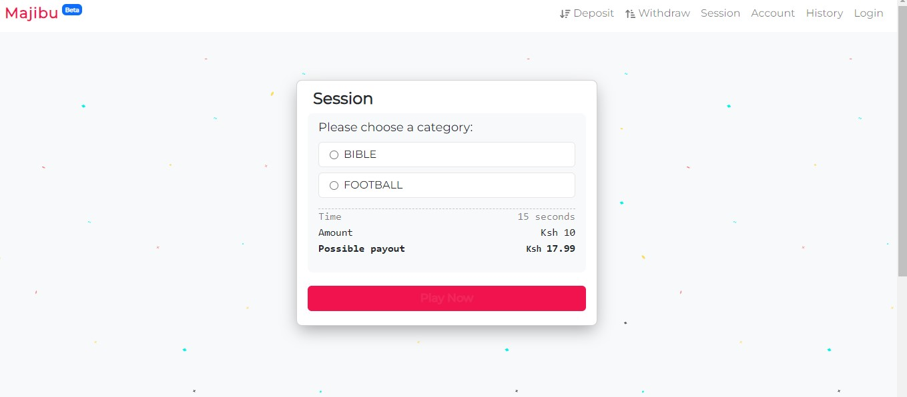
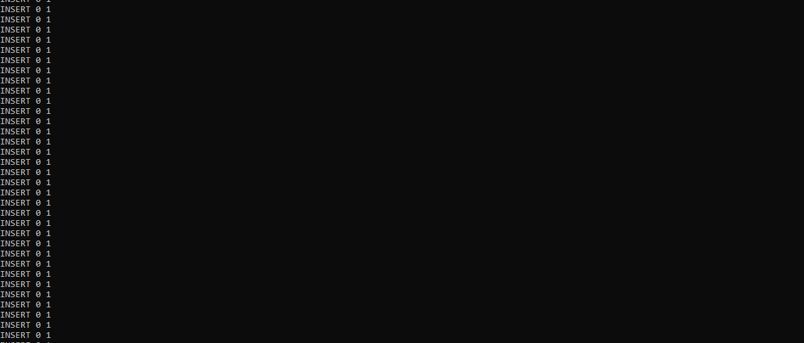
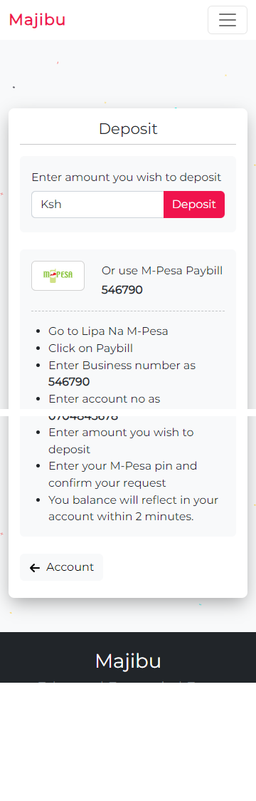
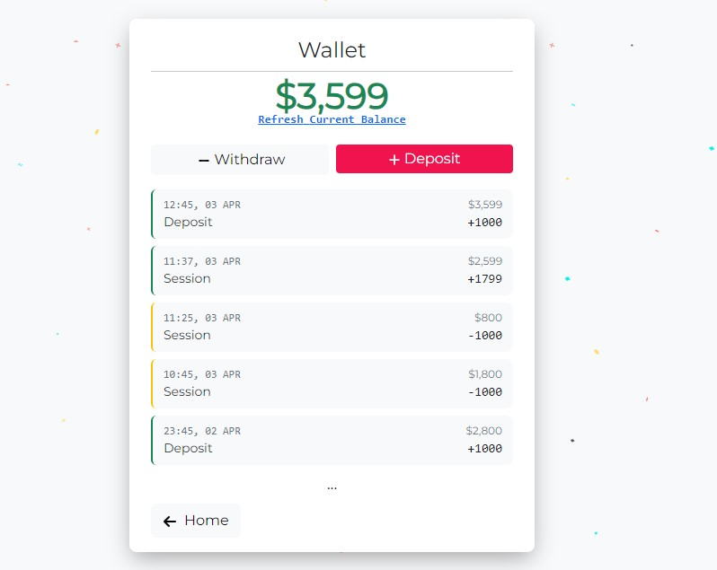
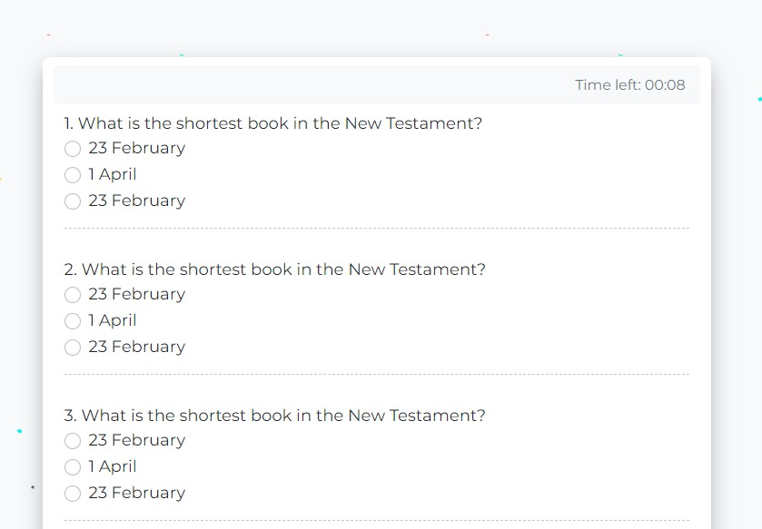
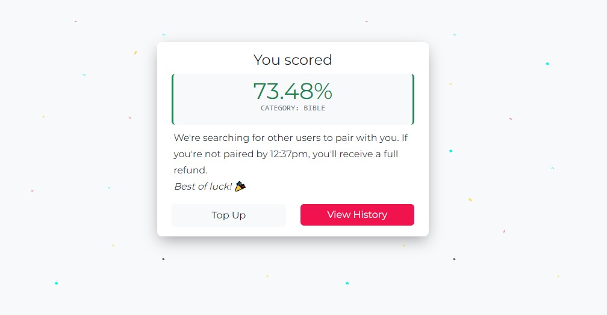
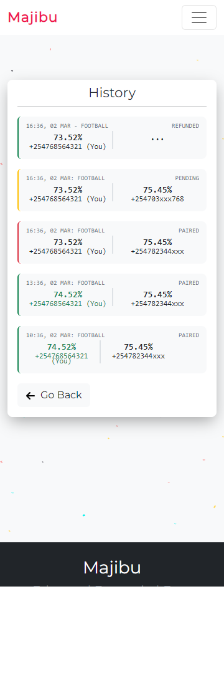

# A Betting App Built on FastAPI

Tech stack used:
- FastAPI
- Redis
- Celery
- Postgresql
- Docker
- Poetry
- Heroku

## How It Works
- A session is basically a set of 5 (multi-choice) questions that a user plays.

- Each session, takes 15 seconds. So try to answer as fast as possible.

- Each user deposits some cash, say 500 kshs.

- Whoever has the highest score, walks out with the bounty, 800 kshs.

- The system retains the 200 kshs.

- Users are paired within 30 minutes. If a user is not refunded within 30 minutes, they receive 105% of their money back.

- So basically, a user either wins the bounty, loses the cash, or gets refunded.

## To start the project the first time using docker

1. Run `docker-compose up --build`. This would setup the docker containers.

2. Once the containers are up and running, go to: http://127.0.0.1:9000/session/ to read the sales page.

3. Click login, and enter your phone number and you will be re-directed to the OTP page.

4. Check the logs to get the OTP. You should see a message like:... Your Majibu OTP is 5044. Do not share it with anyone.

5. To play a session, click on session in the navigation bar or go to http://127.0.0.1:9000/session/home/

6. But we still can't play a session because the database is still empty! So we need to seed it with questions and sessions.

7. In a new terminal, list the running containers using the command: `docker container ls` 

8. Get the CONTAINER ID of the container using postgres.

9. Then seed the database using the command: `docker exec -it <CONTAINER ID> psql -U roro -t majibu -f ./data/dumpfile.sql`

10. That's it!

11. To top up, you'll need to connect to the database, ( `docker exec -it <CONTAINER ID> psql -U <POSTGRES_USER> -h db -t <POSTGRES_DB>`), and add a new deposit. Check the test cases to learn more.

## User flow
1. User lands on the sales page.

2. User signs up to Majibu through OTP verification.

3. User deposits funds into their account using M-Pesa

4. User checks wallet to confirm they funds have been received.

5. User selects the session they want to play

6. Amount is deducted from their wallet as they start their session.

7. User get their score after the session ends.

8. They can also view their session history on the history page (Green means they won, red means they lost and orange means the system is still looking for another user to pair with them.).

